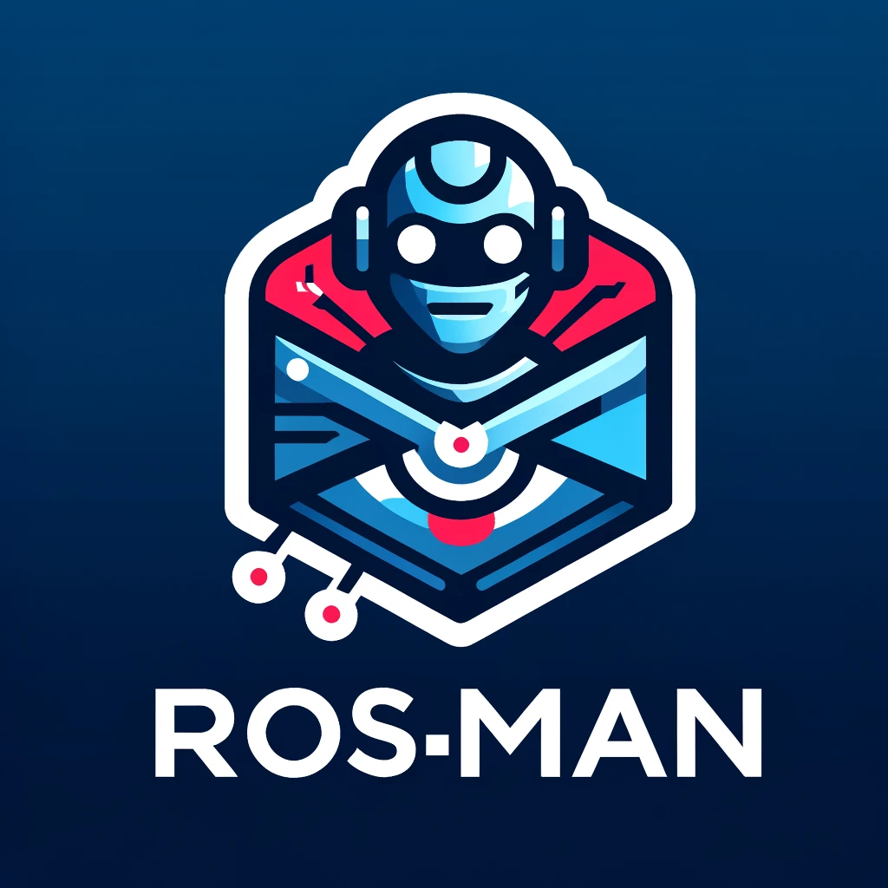

  

# ros-man

A custom Postman clone built in plain JS. Demo: https://rosman.netlify.app/

## Features

- Send GET, POST, PATCH, UPDATE, DELETE requests
- Add headers, data, query params
- View reponse status, time, total size, headers, and response data

## Tech Stack

- HTML
- CSS
- JS
- TailwindCSS
- Axios 
- CodeMirror

---
